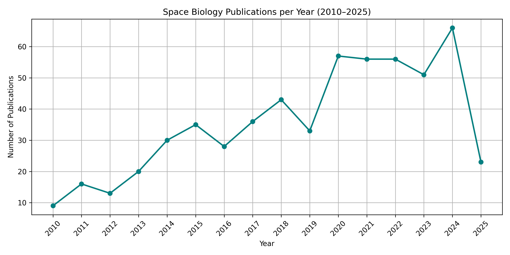

# State of Space Biology (2010 – 2025)

This script was used to build the database that contains all publications in the field of **space biology** from 2010 to 2025. It includes publication links, titles, release dates, and author information, going beyond raw content to capture structured data and relationships. You can install the [dataset from Kaggle](www.kaggle.com/datasets/virajbijpuria/all-space-biology-publications-2010-2025)

The database was built by scraping PubMed Central using **Playwright**, cleaned with **BeautifulSoup**, and stored in a **SQLite database** using **Peewee ORM**. This setup allows you to query publications, authors, and co-authorship relationships efficiently using SQL.

Several interesting trends were uncovered using this database by running the example queries given at the bottom, we have even pasted the results for you to see on this page.  

We encourage you to follow the guide below to get started using SQL for revealing some exciting new insights in Space Biology using our database!

---

# Getting Started

1. Download the database from [Kaggle](www.kaggle.com/datasets/virajbijpuria/all-space-biology-publications-2010-2025)  
2. Navigate to the folder where the DB was installed in the terminal
3. Ensure you have `sqlite3` installed to interact with the database  

On Linux, you can install `sqlite3` using-

```
sudo apt install sqlite3
```

On Mac-

```
brew install sqlite
```

On Windows, one can follow this and further instructions, but it'll be much easier to just install Windows Subsystem for Linux and continue as a Linux user

Once you have navigated to the folder and installed `sqlite3`, you can now run SQL on the DB, here's a template command-

```
sqlite3 -header -column space_bio.db "YOUR QUERY;"
```
Below the DB schema is given, and at the bottom of the page, several example queries are given for you to try out.
You can check out `db.py` in the `database` folder for detailed model definitions if you want to execute PeeweeORM queries.

# Database schema

#### `Pubs` – Publications
| Column    | Type | Description |
|-----------|------|-------------|
| `link`    | TEXT (Primary Key) | Unique URL or DOI of the publication |
| `title`   | TEXT | Title of the publication (unique per DB, but may not be globally unique) |
| `date`    | DATE | Publication date (YYYY-MM-DD) |
| `content` | TEXT | Full content of the publication |

**Purpose:** Store all publication details and content for analysis.

---

#### `Authors` – Authors
| Column | Type | Description |
|--------|------|-------------|
| `name` | TEXT (Primary Key) | Full name of the author |

**Purpose:** List all authors in the dataset.

---

#### `PubAuthors` – Many-to-Many Relationship
| Column           | Type | Description |
|------------------|------|-------------|
| `publication_id` | TEXT (FK → `Pubs.link`) | Publication identifier |
| `author_id`      | TEXT (FK → `Authors.name`) | Author name |

**Primary Key:** Composite (`publication_id`, `author_id`)  

**Purpose:** Link publications to authors, enabling queries about co-authorships, prolific authors, and collaboration patterns.

---


# Example queries

##### Get the top 5 most prolific authors

```bash
sqlite3 -header -column space_bio.db "
SELECT 
    a.name, 
    COUNT(pa.publication_id) as pub_count 
FROM authors a 
JOIN pubauthors pa ON a.name = pa.author_id 
GROUP BY a.name 
ORDER BY pub_count DESC 
LIMIT 5;
"
```

##### Get the top 5 most authored publications

```bash
sqlite3 -header -column space_bio.db "
SELECT 
    p.title, 
    COUNT(pa.author_id) as author_count 
FROM pubs p 
JOIN pubauthors pa ON p.link = pa.publication_id 
GROUP BY p.link 
ORDER BY author_count DESC 
LIMIT 5;
"
```
##### Get the number of publications per year (chronological)

```bash
sqlite3 -header -column space_bio.db "
SELECT 
    strftime('%Y', date) as year, 
    COUNT(*) as pub_count 
FROM pubs 
GROUP BY year 
ORDER BY year;
"
```

# Results of the example queries

#### Get the top 5 most prolific authors

| Name                   | Pub Count |
|------------------------|-----------|
| Kasthuri Venkateswaran | 54        |
| Christopher E Mason    | 49        |
| Afshin Beheshti        | 29        |
| Sylvain V Costes       | 29        |
| Nitin K Singh          | 24        |

##### Get the top 5 most authored publications

| Title                                                                                                                                     | Author Count |
|-------------------------------------------------------------------------------------------------------------------------------------------|--------------|
| The Space Omics and Medical Atlas (SOMA) and international astronaut biobank                                                              | 109          |
| Cosmic kidney disease: an integrated pan-omic, physiological and morphological study into spaceflight-induced renal dysfunction           | 105          |
| Molecular and physiologic changes in the SpaceX Inspiration4 civilian crew                                                                | 59           |
| Single-cell multi-ome and immune profiles of the Inspiration4 crew reveal conserved, cell-type, and sex-specific responses to spaceflight | 50           |
| NASA GeneLab RNA-Seq Consensus Pipeline: Standardized Processing of Short-Read RNA-Seq Data                                               | 45           |

##### Get the number of publications per year (chronological)

